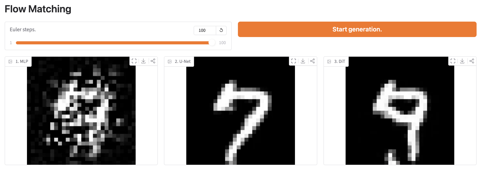
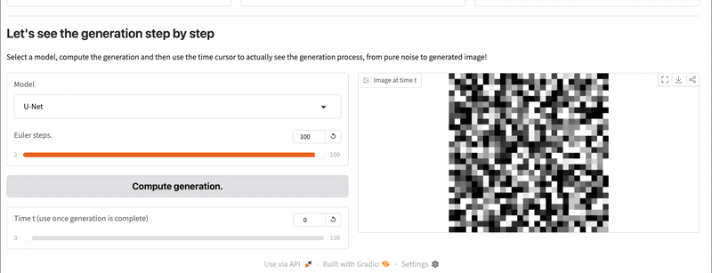

# Flow Matching 

A from-scratch PyTorch R&D project exploring **Optimal Transport Flow Matching (OT-CFM)**, the current state-of-the-art framework for generative modeling. Several models will be trained in order to generate images from the MNIST dataset. This repository will only deal with those images because they are small (28x28, 1 channel), which is enough to train and see results on a personal laptop. Obviously, the code can be adapted for other images with a bigger format.

## Theoretical Background of Flow Matching

The goal of this project is to implement the equations described in the paper "Flow Matching for Generative Modeling". Here, I will try to summarize the main mathematical equations in order to fully understand the problem and the implementation. For more details, please refer to the main papers (see the section References). You can also skip this section if you are not interested in the mathematics beyond Flow Matching, the next section will summarize the necessary ideas used for the implementation.

Let $p_t: [0, 1] \times \mathbb{R}^d \to \mathbb{R}_+^*$ be a time-dependent probability density path, and $v_t: [0, 1] \times \mathbb{R}^d \to \mathbb{R}^d$ be a time-dependent vector field. The vector field $v_t$ generates a probability path $p_t$ via a flow $\phi_t: [0, 1] \times \mathbb{R}^d \to \mathbb{R}^d$, which is defined as the solution to the following ODE:

$$\frac{\partial}{\partial t}\phi_t(x) = v_t(\phi_t(x)) \quad \text{with} \quad \phi_0(x) = x$$

To parameterize this system for generative modeling, the vector field is defined using a neural network $v_t(x; \theta)$ with parameters $\theta$, which we optimize to track a target vector field $u_t$ that generates a path connecting noise $p_0$ to data $p_1 \approx p_{\text{data}}$. For such an optimization, the following loss function can be used to train a neural network:

$$\mathcal{L}_{\text{FM}}(\theta) = \mathbb{E}_{t \sim U[0,1], \, x \sim p_t(x)} \left[ \| v_t(x; \theta) - u_t(x) \|^2 \right]$$

However, the target vector field $u_t(x)$ and $p_t(x)$ are not known for the entire population, making this loss function useless in practice. The paper introduces a new loss function, using conditional probability:

$$\mathcal{L}_{\text{CFM}}(\theta) = \mathbb{E}_{t \sim U[0,1], \, x_1 \sim p_{\text{data}}, \, x \sim p_t(x|x_1)} \left[ \| v_t(x; \theta) - u_t(x|x_1) \|^2 \right]$$

Unlike $\mathcal{L}_ {\mathrm{FM}}$, which requires knowing the global vector field $u_ t(x)$, $\mathcal{L}_{\mathrm{CFM}}$ uses a simpler and closed-form conditional vector fields $u_t(x|x_1)$ operating on local data paths. The paper proves that:

$$\nabla_{\theta} \mathcal{L}_{\mathrm{FM}}(\theta) = \nabla_{\theta} \mathcal{L}_{\mathrm{CFM}}(\theta)$$

meaning that minimizing the localized conditional loss yields the exact same optimal parameters as minimizing the intractable global loss.

For Gaussian conditional probability paths defined as $p_t(x|x_1) = \mathcal{N}(x; \mu_t(x_1), \sigma_t(x_1)^2 I)$, the paper derives a specific, closed-form expression for the target conditional vector field, given by:

$$u_t(x | x_1) = \frac{\dot{\sigma}_t(x_1)}{\sigma_t(x_1)} \Big( x - \mu_t(x_1) \Big) + \dot{\mu}_t(x_1)$$

Where $\dot{\mu}_t(x_1)$ and $\dot{\sigma}_t(x_1)$ are the time derivatives $\frac{\partial}{\partial t}\mu_t(x_1)$ and $\frac{\partial}{\partial t}\sigma_t(x_1)$. This explicit formula allows us to compute the target velocity vector for any sample $x$ at time $t$ instantly during training without running an ODE solver or backpropagating through time.

In this repository, the selected probability path is defined by a simple linear interpolation between the source noise $x_0 \sim \mathcal{N}(0, I)$ and the target data $x_1$:

$$x_t = (1 - t)x_0 + t x_1$$

This method was introduced in the paper "Improving and Generalizing Flow-Based Generative Models with Minibatch Optimal Transport", and it corresponds to a Gaussian conditional probability path where:
*   $\mu_t(x_1) = t x_1 \implies \dot{\mu}_t(x_1) = x_1$
*   $\sigma_t(x_1) = 1 - t \implies \dot{\sigma}_t(x_1) = -1$

Using these exact derivatives into the closed-form conditional vector field equation gives:

$$u_t(x | x_1) = \frac{-1}{1 - t} \Big( x - t x_1 \Big) + x_1 = x_1 - x_0$$

## Core Equations for this Repository

**In a nutshell**, a model (MLP, U-Net, ...) that takes an interpolated state $x_t \in \mathbb{R}^d$ and a time step $t \in [0, 1]$ as inputs, and returns a velocity prediction $v_t \in \mathbb{R}^d$, can learn the target vector field just by using the Mean Squared Error (MSE) between its prediction and the target velocity $x_1 - x_0$, where $x_1$ is a real data sample from our dataset and $x_0$ is pure random noise sampled from a standard Gaussian distribution. Once trained, the model can generate new data by starting from random noise and iteratively applying the predicted velocities using an ODE solver (Euler Method for example).

I also wanted to add that, even if the mathematical theory is formulated for vectors $x \in \mathbb{R}^d$, it applies seamlessly to images. An image can be represented as a tensor in $\mathcal{M}_{height, width}(\mathbb{R})^{channels}$, which is isomorphic to $\mathbb{R}^{height \times width \times channels}$, thus, they can be processed directly or flattened without violating the underlying equations.

## Project Architecture

* `artefacts/`: Saved artefacts from notebooks.
* `configs/`: Configuration files.
* `notebooks/`: Notebooks for studying.
* `scripts/`: Executable entry points for training, evaluation and demo.
* `src/`: Main source code package.
* `tests/`: Unit tests.

## Key Takeaways

Here is a summary of what I have learned during this project:
- Discovered and dived into Flow Matching theory for generative models, studying Optimal Transport.
- Implemented U-Net and DiT models, which helped me reinforce my theoretical knowledge of these architectures.
- Understood the FID metric for rigourous evaluating models generating images.
- Improved my skills in PyTorch by implementing state-of-the-art architectures, tackling models training (gradient exploding) and hardware limitations on MPS.

Next steps could be:
- Explore other way to define $u_t(x | x_1)$.
- Explore other architectures.
- Test on other dataset (CIFAR, ...).
- Include a user prompt to "control" the generation.

## Demo

You can launch a demo to see the results with the 3 models (MLP, U-Net, DiT) trained in the 3 notebooks:

```bash
python scripts/demo.py
```


You can even see the generation path in the demo!



## Tests

Basic unit tests can be launched with pytest:

```bash
pytest tests/
```

## References

```bibtex
@article{lipman2023flow,
  title={Flow Matching for Generative Modeling},
  author={Lipman, Yaron and Chen, Ricky T. Q. and Ben-Hamu, Heli and Nicklas, Maximilian and Le, Matt Le and Le, Matt and Grover, Aditya},
  year={2023},
  url={https://arxiv.org/abs/2210.02747}
}
@article{tong2023improving,
  title={Improving and Generalizing Flow-Based Generative Models with Minibatch Optimal Transport},
  author={Tong, Alexander and Malkin, Nikolay and Huguet, Guillaume and Zhang, Yanrui and Rector-Brooks, Jarrid and Fatras, Kilian and Wolf, Guy and Bengio, Yoshua},
  year={2023},
  url={https://arxiv.org/abs/2302.00482}
}
```
